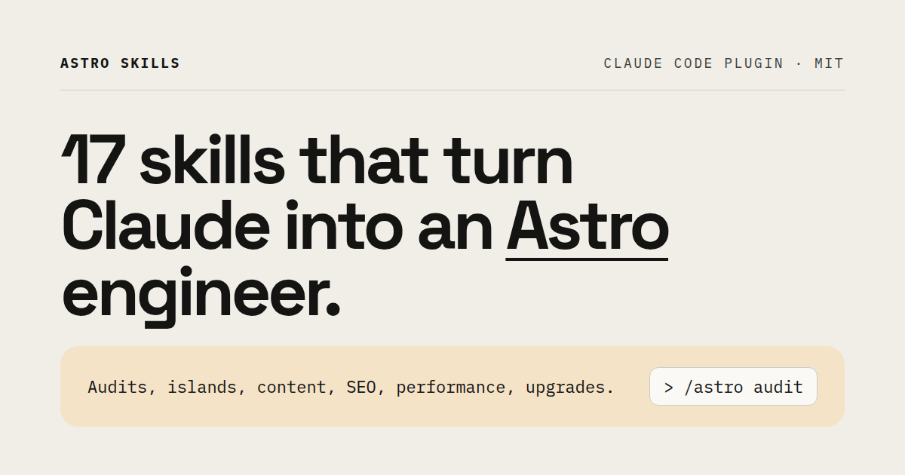

# Astro Skills for Claude Code

**Astro Skills turns Claude Code into a senior Astro engineer.** It's an open-source plugin with 17 focused skills and 5 audit agents. Together they cover project audits, scaffolding, components, islands, content collections, routing, i18n, SEO, images, performance, styling, Actions, view transitions, accessibility, deployment and version upgrades.

Every skill starts by reading your project: the installed Astro version, config, adapter and source. Claude works from facts about your project, so it doesn't suggest APIs your version has removed.

[](https://github.com/JordiParraCrespo/astro-skills/actions/workflows/ci.yml)
[](LICENSE)


**Website:** https://jordiparracrespo.github.io/astro-skills

## Install

### Plugin marketplace (recommended)

```bash
/plugin marketplace add JordiParraCrespo/astro-skills
/plugin install astro-skills@astro-skills
```

### Manual (macOS / Linux)

```bash
git clone --depth 1 https://github.com/JordiParraCrespo/astro-skills.git
bash astro-skills/install.sh      # copies into ~/.claude (override with CLAUDE_HOME)
bash astro-skills/uninstall.sh    # removes exactly what was installed
```

The scanner needs Node 18+. None of this is added to your Astro project.

## Quick start

```bash
cd my-astro-site
claude

/astro audit                 # full audit, 5 agents in parallel, writes ASTRO-AUDIT.md
/astro perf src/pages/blog   # or go straight to a specialist
/astro upgrade               # migrate one major at a time
```

You can also skip commands and describe the problem ("why is my LCP 4 seconds?"). Claude loads the matching skill.

## Skills

| # | Skill | Command | What it does |
|---|-------|---------|--------------|
| 00 | `astro` | `/astro <command> [path]` | The orchestrator. Detects your project, picks the right specialist, and fans out audits in parallel. |
| 01 | `astro-audit` | `/astro audit [path]` | Scans, fans out five specialist agents in parallel, and scores your project 0–100 with a prioritized fix plan. |
| 02 | `astro-init` | `/astro init <name>` | Scaffolds a new project with strict types, sitemap, robots, typed env, Tailwind v4 and an SEO-ready layout. |
| 03 | `astro-components` | `/astro components [path]` | Typed props, composable slots and zero-JS components that stay small, owned and easy to change. |
| 04 | `astro-routing` | `/astro routing [path]` | Typed dynamic routes, endpoints and middleware, prerendered by default and on-demand only where needed. |
| 05 | `astro-styling` | `/astro styling [path]` | Tailwind v4 on design tokens, scoped styles only where utilities can't reach, and dark mode without the flash. |
| 06 | `astro-islands` | `/astro islands [path]` | Justifies every `client:*` directive, defers personalized HTML to server islands and keeps the JS budget honest. |
| 07 | `astro-content` | `/astro content [path]` | Type-safe content on the Content Layer: loaders, strict schemas, references and a clean legacy migration. |
| 08 | `astro-i18n` | `/astro i18n [path]` | Built-in i18n routing with parallel locale routes, locale-aware links, hreflang and a real switcher. |
| 09 | `astro-images` | `/astro images [path]` | Moves every image through `astro:assets` with correct sizes, formats, alt text and LCP priority. |
| 10 | `astro-perf` | `/astro perf [path]` | Holds a Lighthouse mobile budget by fixing the Astro-specific causes of slow LCP, CLS and INP. |
| 11 | `astro-transitions` | `/astro transitions [path]` | Smooth navigations with native CSS first, `<ClientRouter />` when needed, and scripts that survive the swap. |
| 12 | `astro-seo` | `/astro seo [path]` | One typed head component, correct canonicals, JSON-LD, sitemap, robots, llms.txt and RSS, verified in `dist/`. |
| 13 | `astro-a11y` | `/astro a11y [path]` | WCAG 2.2 AA with native HTML primitives first, verified by axe and keyboard tests. |
| 14 | `astro-actions` | `/astro actions [path]` | Zod-validated Astro Actions with forms that work without JS and fail safely under abuse. |
| 15 | `astro-deploy` | `/astro deploy [target]` | Picks the right output and adapter, types every env var, and ships correct headers and caching per host. |
| 16 | `astro-upgrade` | `/astro upgrade [path]` | One major at a time, guided by the official guide, verified by check, build and a visual diff. |

### Audit agents

`astro-audit` runs these read-only subagents in parallel: `astro-architect`, `astro-performance`, `astro-seo`, `astro-accessibility` and `astro-security`.

## The scanner

`skills/astro/scripts/astro-scan.mjs` is a single Node script with no dependencies. It only reads files. It detects the Astro version, output mode, adapter, integrations and UI frameworks, then checks 19 rules across architecture, performance, SEO, accessibility and security.

```bash
node skills/astro/scripts/astro-scan.mjs ./my-site          # human-readable
node skills/astro/scripts/astro-scan.mjs ./my-site --json   # for agents and CI
```

Scoring: start at 100 and subtract a penalty for each rule that fires (critical 15, high 8, medium 3, low 1). A single rule never costs more than twice its weight.

## Repository layout

```
.claude-plugin/   plugin.json + marketplace.json
skills/           one directory per skill (SKILL.md is the source of truth)
agents/           audit subagents
site/             Astro landing page, built from skills/ and agents/
tests/            scanner tests + fixtures (node:test)
scripts/          validate.mjs (structure checks)
```

## Development

```bash
npm run check                          # structure validation + scanner tests
npm --prefix site install && npm run dev   # landing site on localhost:4321
npm run build                          # production build of the site
```

The landing site reads `skills/*/SKILL.md` and `agents/*.md` as Astro content collections. Adding a skill directory therefore adds its page, its card and its `llms.txt` entry. By default the site deploys to GitHub Pages under `/astro-skills`. For a custom domain, set `SITE_URL` and `BASE_PATH=/`.

## License

MIT. Not affiliated with Astro Technology Company or Anthropic.
